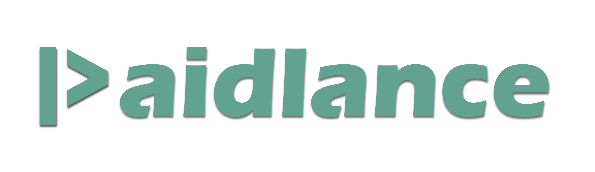

A place where freelancers are empowered to get paid for their hard work
without having to worry about unjustified backdate refunds!

## Diverging from the norm, while still honoring the importance of clients, we prioritize the welfare of freelancers over all else.

At Paidlance, freelancers and clients alike find a secure platform where work is valued and payments are not going to be rolled back.

Our mission is simple: to create a fair and transparent environment where freelancers can focus on delivering exceptional work, knowing they'll be compensated fairly for their time and expertise.

With our streamlined process, clients have a limited window of 24 hours to request refunds, preventing any backdated requests and fostering a fair environment for freelancers.

### The main goal of the project is to develop a ready-to-use website (product) that serves the needs of freelancers and clients alike. 

Making it open source is an added bonus, reflecting a belief in transparency and collaboration. 

However, it is essential to note that the development process will not be slowed down or halted to grow the open source aspect. The priority remains the continuous and efficient development of the platform.

## Active Repositories
There are two main active repositories in the **Paidlance** GitHub organization:

- [paidlancedev](https://github.com/Paidlance/paidlancedev): This repository uses Angular
- [paidlancework](https://github.com/Paidlance/paidlancework): This repository uses Next.js

Each repository offers the same features, as we've decided to include both frameworks, ensuring developers can contribute using their preferred technology stack without limitation.

Eventually, the more robustly developed option will emerge as the primary platform.

## Contributing

We welcome contributions from the community to enhance Paidlance! To get involved, please refer to the contributing guidelines for [paidlancedev](https://github.com/Paidlance/paidlancedev/blob/main/CONTRIBUTING.md) and [paidlancework](https://github.com/Paidlance/paidlancework/blob/main/CONTRIBUTING.md). Whether you're interested in code improvements, bug fixes, or new features, your contributions are greatly appreciated and will help shape the future of the platform.